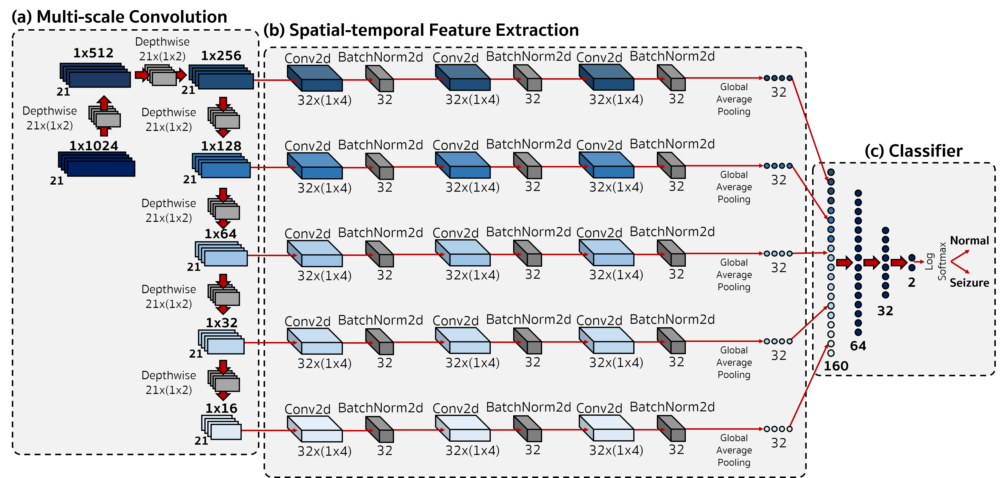

# EEGWaveNet: Multi-Scale CNN-Based Spatiotemporal Feature Extraction for EEG Seizure Detection

## Abstract
*The detection of seizures in epileptic patients via Electroencephalography (EEG) is an essential key to medical treatment. With the advances in deep learning, many approaches are proposed to tackle this problem. However, concerns such as performance, speed, and subject-independency should still be considered. Thus, we propose EEGWaveNet, a novel end-to-end multi-scale convolutional neural network designed to address epileptic seizure detection. Our network utilizes trainable depth-wise convolutions as discriminative spectral filters to gather multi-scale spectral information from each EEG channel. Then, the spatial-temporal features are extracted from each scale for further classification. To demonstrate the effectiveness of EEGWaveNet, we evaluate the model in two datasets: CHB-MIT and TUSZ. From the results, EEGWaveNet outperforms other baseline methods in performance for both subject-dependent and independent approaches, while having time complexity comparable to the compact EEGNet-8,2. Moreover, we transfer the model trained from the subject-independent approach and fine-tune it with a one-hour recording, achieving an F1-score (Binary) improvement of about 15\% in average compared to without fine-tuning. This study indicates the possibility of further developing this model and the fine-tuning methodology toward healthcare 5.0, where the AI aid clinicians in a manner of man-machine collaboration.*


<p align="center"> 
<b>Figure</b> Overall visualization of EEGWaveNet architecture (a) Multi-scale convolution module, (b) Spatial-temporal feature extraction module, and (c) Classifier module consists of fully connected layers and activation for two-class classification. 
</p>

## Note
```
## The source codes will be published with accepted manuscript
```
